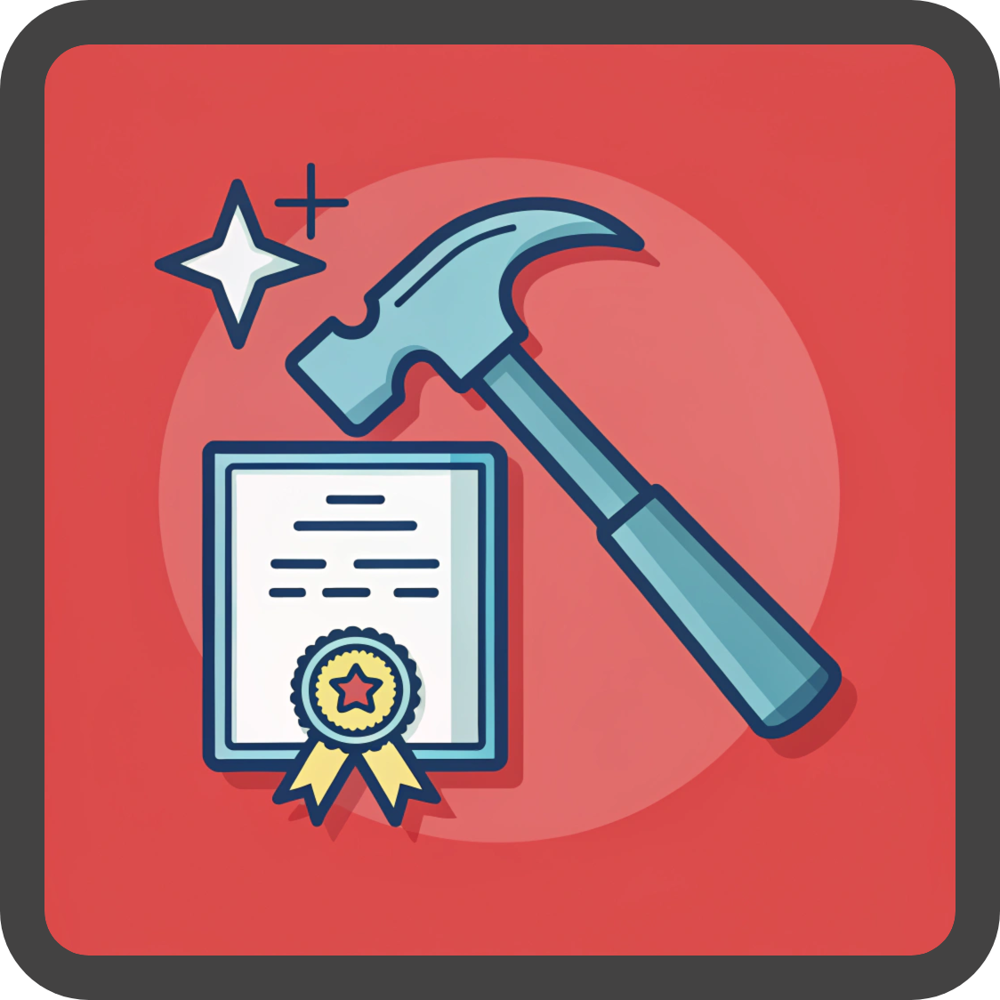

# SmashThatCert

## 1 Components

### 1.1 frontend
### 1.2 backend
### 1.3 scraper

## 2 How to run

To run che **webapp** you need to lauch this command by command line
```console
python -m streamlit run ./Frontend/main.py --client.showSidebarNavigation=False
```

To run a **full ingestion** of the questions, run this command. 
```console
python ./Scraper/ingest_questions.py --full
```
This process can take a while, since there are some delays between each question and between each exam, to avoid ban from sources 

If you want to **ingest only a single exam**, you can do it in this way:
```console
python ./Scraper/ingest_questions.py --exam_id 1
```
and if you want to **specify the range** of questions you need to ingest, just add those 2 parameters at the command:
```console
python ./Scraper/ingest_questions.py --exam_id 1 --from_question 1 --to_question 10
```
All the metadata about what exams to ingest in the database and the number of question for each exam is set in the **scraper_config.yaml** file. There you can also find the exam_id related to a specific exam

## Docker

```console
docker build -t smashthatcert .
```

```console
docker run -it -p 8501:8501 -d smashthatcert
```